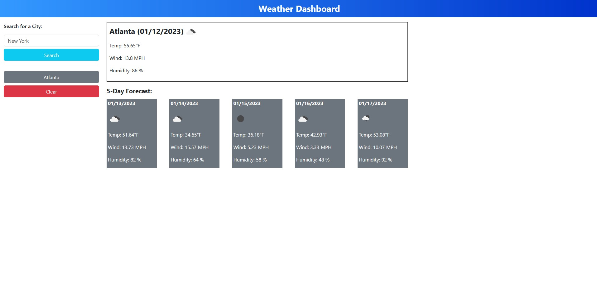

# Weather Forecaster

<!-- PROJECT LOGO -->
 

  <h3 align="center">Weather Forecaster</h3>
 
  

    Challenge 6 on Weather Forecaster.

  

## Demo
 

  
Demo picture(click to show)

(<a href="#readme-top">back to top</a>)

<!-- ABOUT THE PROJECT -->
## About The Project

### portfolio summary:
<li>Used Jquery to update webpage and write function ;
<li>Get data from openweather API to present based on the time of the user;
<li>From two different URLs the script will go fetch data;
<li>Get weather icon from openweather API;
<li>Utilized dayjs library to convert UTC time to city time;
<li>Validated the user input, using javascript regex;
<li>Also validation: if city name is not found, catch that error and show user 'invalid city name' and try one more time. (Not necessary in thi project? Not done.)

### potential bug
<li>During certain hour, there will be a bug that no data shows up for the last day of the forward 5 days. This is due to how openweather API presents data. e.g. for EST cities, from midnight to 1:00AM, data will only cover forward 4 days forward. I assume that will be the same for cities in other timezone but the not working hour will vary.

(<a href="#readme-top">back to top</a>)

<!-- LICENSE -->
## License

Distributed under the MIT License. See `LICENSE.txt` for more information.

(<a href="#readme-top">back to top</a>)

<!-- CONTACT -->
## Contact

Lantao Zhang - lantaook@gmail.com

Project Link: [https://pppzlt.github.io/bc-weather/](https://pppzlt.github.io/bc-weather/)

(<a href="#readme-top">back to top</a>)

